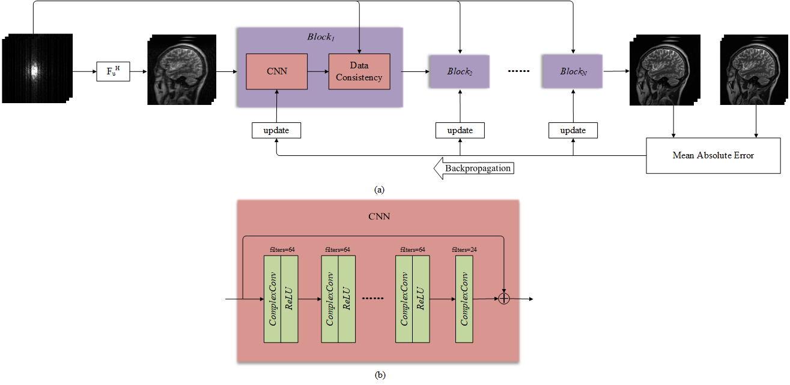
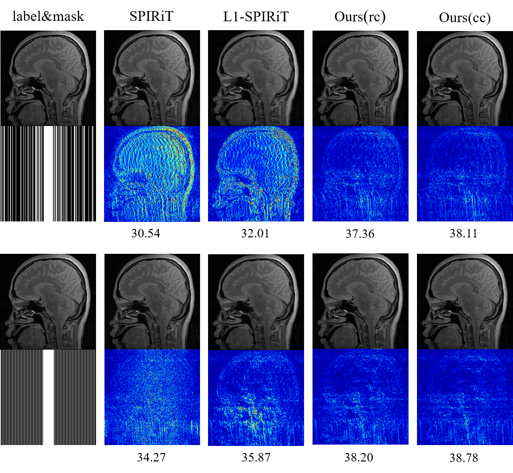

# DeepMRI
**DeepMRI: Exploiting deep residual network for fast parallel MR imaging with complex convolution**  

By Shanshan Wang, Huitao Cheng, Taohui Xiao, Leslie Ying, Ziwen Ke, Hairong Zheng, Dong Liang\*  

This repository contains the implementation of DeepMRI for parallel MR imaging using Tensorflow-gpu. Test code for Matlab and test data are also included. For a quick test, the trained weights can be used. The folder saved_model_vn contains the model of the trained VN dataset for the knee images.  

**The architecture of DeepMRI for parallel MR imaging**    

  

**Reconstruction Results by classical SPIRiT/L1-SPIRiT and the proposed method**    

More results can be found in the paper.   

**Dependencies**  

* Python3
* Tensorflow
* numpy scipy
